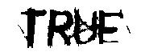
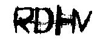
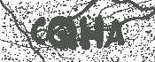
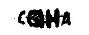
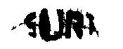
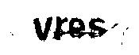
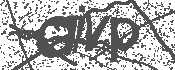
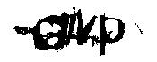

# Cleaning captcha images (*under development*)

My objective is to develop a program
whose input is a captcha image, such as the 
image down bellow 

     

and to output a cleaner image, that is, an image without noise 
and whose pixels are visual components of letters.

## Results so far

I have applied algorithms such as Naive Bayes,
Logistic Regression and SVM to each pixel of an
image to obtain the final version. Such methods are on their respective 
branch.

As an example, down below I have applied the SVM hypothesis class
into a collection of images obtaining what is understod by the best
classifier as the real image.

1.

     
     

2. 

     
     

3. 

     
     

4. 

     
     

5. 

     
     

6. 

     
     

## Future work
I still need to
* Implement an algorithm that splits the cleaned
captchas - obtained previously - into 4 images where each one of them are
containing possible letters
* Finally, After spliting the images 
 I need to implement an algorithm in order to classify
 the letters of the splitted images

So far I think that the segmentation problem is 
going to be the more tedious...

